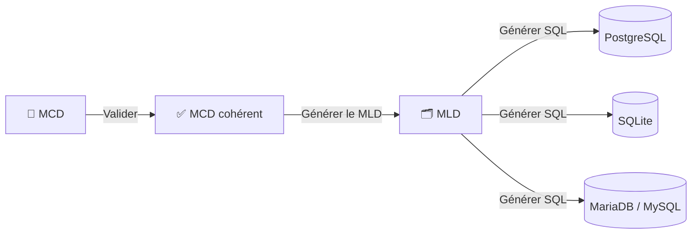

<p align="center">
  
</p>

<h1 align="center">MERISOR</h1>

<p align="center">
  <strong>Du modèle métier au script SQL, dans une application de bureau libre.</strong>
</p>

<p align="center">
  <a href="https://github.com/nouhailler/merisor/releases/latest"></a>
  
  
  
  <a href="https://github.com/nouhailler/merisor/actions/workflows/quality.yml"></a>
  <a href="https://github.com/nouhailler/merisor/blob/main/LICENSE"></a>
  <a href="https://pypi.org/project/merisor/"></a>
</p>

MERISOR est un éditeur graphique MERISE pour Linux. Il permet de dessiner un
MCD, de contrôler sa cohérence, de produire un MLD structuré puis de générer un
script SQL pour PostgreSQL, SQLite ou MariaDB/MySQL. Le modèle peut aussi être
préparé par une IA via OpenRouter, avec validation et confirmation avant import.

> [!IMPORTANT]
> MERISOR génère du SQL, mais ne se connecte à aucune base de données et
> n’exécute jamais le script. Le MCD reste toujours la source de vérité.

## 📸 Aperçu

### Édition d’un MCD


### Typage des attributs MCD


<table>
  <tr>
    <td width="50%"><strong>MLD graphique et propriétés</strong></td>
    <td width="50%"><strong>Aperçu SQL avant export</strong></td>
  </tr>
  <tr>
    <td></td>
    <td></td>
  </tr>
</table>

### Import d’un MCD proposé par l’IA


## 🧭 MERISE en trente secondes

Vous découvrez MERISE ? Voici les trois niveaux manipulés par l’application :

| Niveau | Rôle | Exemple |
|---|---|---|
| **MCD** — Modèle Conceptuel de Données | Décrit les objets métier et leurs liens, sans dépendre d’une base | `PILOTE participe à COURSE` |
| **MLD** — Modèle Logique de Données | Transforme le MCD en tables, colonnes, PK et FK | `PARTICIPER(id_pilote, id_course)` |
| **SQL** | Traduit le MLD dans le dialecte d’un SGBD | `CREATE TABLE ...` |

Le flux est volontairement unidirectionnel :



## ✨ Fonctionnalités

### 🧩 Modélisation MCD

- création, sélection, déplacement et suppression d’entités et d’associations ;
- relations attachées aux objets : les lignes et cardinalités suivent les
  déplacements ;
- attributs d’entités et d’associations ;
- types logiques explicites ou automatiques, avec longueur de `VARCHAR` et
  précision/échelle de `DECIMAL` ;
- propriétés complètes des attributs : présence obligatoire/facultative,
  valeur par défaut, unicité, commentaire, auto-incrémentation et expressions
  `CHECK` ;
- identifiants simples ou composés, repérés par `#` ;
- cardinalités `(0,1)`, `(0,N)`, `(1,1)` et `(1,N)` ;
- associations historisées ;
- stratégies `AUTO`, `FORCE_TABLE` et `FORCE_FK` ;
- associations réflexives avec rôles de branche, et associations n-aires ;
- spécialisations ISA avec stratégies mère seule, filles seules ou jointes ;
- annuler/rétablir pour les principales opérations ;
- zoom, déplacement du canvas et disposition automatique du graphe ;
- export visuel du MCD ou du MLD actif en PNG haute résolution, SVG ou PDF ;
- sauvegarde JSON versionnée, chargement V1/V2 et fichiers récents.

### ✅ Validation MERISE

- noms manquants ou dupliqués ;
- entités sans identifiant ;
- attributs dupliqués ;
- associations reliées à moins de deux entités ;
- relations incomplètes, cardinalités invalides et rôles réflexifs dupliqués ;
- incompatibilités entre historisation, `FORCE_FK` et N:N ;
- rapport distinguant erreurs bloquantes et avertissements.

### 🧠 Analyse intelligente de la qualité

La commande **Modèle → Analyser la qualité du modèle** ajoute une seconde
couche non bloquante, entièrement locale et sans IA :

- types suggérés à partir du nom (`date_naissance` → `DATE`, `prix` →
  `DECIMAL(10,2)`, `est_actif` → `BOOLEAN`, etc.) ;
- suggestions d'unicité pour les courriels, identifiants de connexion,
  références et identifiants métier courants ;
- détection d'entités aux noms proches, synonymes ou partageant de nombreux
  attributs, en ignorant les couples mère/fille ISA ;
- contrôle des conventions de nommage majoritaires pour les entités,
  associations et attributs ;
- signaux de normalisation : attributs numérotés, listes encodées dans un
  champ, attributs composés, clés étrangères techniques présentes dans le MCD
  et objets anormalement larges ;
- score global pondéré et six scores détaillés, avec chaque déduction affichée
  et expliquée.

Les résultats sont des recommandations avec un niveau de confiance. Ils ne
modifient jamais automatiquement le MCD et ne remplacent pas la validation
structurelle MERISE.

### 🎓 Assistant de normalisation

La commande **Modèle → Assistant de normalisation** accompagne l'utilisateur
sans masquer les hypothèses métier :

- saisie et modification de dépendances fonctionnelles composites `X → Y` ;
- calcul de fermeture d'attributs et recherche déterministe des clés candidates ;
- vérification formelle de la 2NF et de la 3NF à partir des dépendances saisies ;
- détection heuristique des listes, attributs composés et groupes répétitifs
  susceptibles d'enfreindre la 1NF ;
- rapport pédagogique expliquant chaque constat et son « Pourquoi ? » ;
- aperçu d'une décomposition dans un MCD projeté, sans toucher au document ;
- application confirmée des extractions 3NF non ambiguës en une opération
  entièrement annulable ;
- suggestions OpenRouter facultatives, asynchrones et toujours soumises à
  confirmation humaine.

> [!NOTE]
> La 1NF dépend de la signification des données : MERISOR signale donc des
> indices, pas des certitudes. Les conclusions 2NF/3NF ne sont complètes que si
> toutes les dépendances métier pertinentes ont été déclarées.

### 🗂️ Génération du MLD

- tables et colonnes issues du MCD ;
- PK et FK simples ou composées ;
- nullabilité et contraintes UNIQUE nécessaires aux relations 1:1 ;
- matérialisation des associations N:N et des associations historisées ;
- PK technique déterministe pour une association historisée sans identifiant ;
- conservation de la provenance MCD → MLD ;
- vues graphique et textuelle, zoom, copie et export ;
- indicateur **à jour / obsolète** après modification du MCD.

### 🛢️ Génération SQL

- PostgreSQL, SQLite et MariaDB/MySQL ;
- PK, FK, UNIQUE, CHECK et index explicites ;
- `NULL` / `NOT NULL` et identifiants auto-incrémentés ;
- ordre de création selon les dépendances et prise en charge des cycles ;
- échappement des identifiants et avertissement pour les mots réservés ;
- aperçu, copie et export en `.sql` ;
- aucune connexion et aucune exécution automatique.

### 🔄 Reverse-engineering SQL / DDL

- import de fichiers `.sql` et `.ddl` PostgreSQL ou SQLite ;
- reconstruction fidèle du MLD : tables, colonnes, types, PK simples ou
  composées, FK, UNIQUE, CHECK et index ;
- reconnaissance des tables de jointure comme associations MCD ;
- reconstruction des relations 1:N et des FK réflexives ;
- détection d'une spécialisation ISA `JOINED` lorsqu'une PK est également une
  FK vers une table mère ;
- aperçu du MLD, du MCD heuristique et du DDL source avant confirmation ;
- aucun changement du document courant sans validation explicite.

### ✨ Génération assistée par IA

- clé OpenRouter stockée hors des projets ;
- test de la clé et récupération des modèles texte gratuits ;
- choix du modèle et activation explicite de l’IA ;
- génération d’un JSON MERISOR V2 depuis une description métier ;
- aperçu, JSON éditable et double validation avant import ;
- aucune modification du document courant sans confirmation ;
- appel de génération exécuté dans un thread Qt avec progression indéterminée,
  afin de conserver une interface réactive ;
- organisation automatique du graphe après import.

### 🗣️ Prochaine étape : assistant MERISE conversationnel

La prochaine évolution prévue transformera la génération ponctuelle en un
assistant de conception. À partir d'une description métier, il devra détecter
les concepts, rendre ses hypothèses visibles puis poser les questions qui
modifient réellement le modèle : cardinalités, historisation, distinction entre
concept et occurrence physique, ou choix entre entité et association.

Le principe de sécurité restera le même :

```text
Conversation
    ↓
Brouillon MCD isolé et versionné
    ↓
Validation déterministe MERISOR
    ↓
Aperçu des différences
    ↓
Import confirmé et annulable
```

Les réponses OpenRouter devront respecter une enveloppe JSON stricte contenant
le message, les concepts détectés, les hypothèses, les questions et un patch du
brouillon. Le texte de conversation ne deviendra jamais directement la source
de vérité et aucun changement ne sera appliqué silencieusement. Cette
fonctionnalité est documentée dans [CONTEXT.md](CONTEXT.md), mais n'est pas
encore implémentée.

## 🚀 Installation

### Option A — AppImage universelle

Cette option convient à Fedora, Arch Linux, openSUSE, Debian, Ubuntu et à la
plupart des distributions Linux 64 bits récentes :

1. Téléchargez `MERISOR-<version>-x86_64.AppImage` depuis la page
   [Releases](https://github.com/nouhailler/merisor/releases/latest).
2. Rendez le fichier exécutable et lancez-le :

```bash
chmod +x MERISOR-*.AppImage
./MERISOR-*.AppImage
```

L’AppImage embarque Python, PySide6 et les dépendances de l’application. Elle
ne demande pas d’installation administrateur et ne modifie pas le système.

> [!NOTE]
> Le runtime AppImage embarqué est autonome et ne requiert pas `libfuse2`.
> Si le montage des AppImage est interdit sur votre système, utilisez
> `APPIMAGE_EXTRACT_AND_RUN=1 ./MERISOR-*.AppImage`.

### Option B — paquet Debian / Ubuntu

1. Téléchargez le fichier `.deb` depuis la page
   [Releases](https://github.com/nouhailler/merisor/releases/latest).
2. Ouvrez un terminal dans le dossier de téléchargement.
3. Installez le paquet :

```bash
sudo apt install ./merisor_0.6.1_amd64.deb
```

Adaptez le nom au fichier téléchargé. MERISOR apparaît ensuite dans le menu des
applications et peut aussi être lancé avec :

```bash
merisor
```

### Option C — installation depuis les sources

Prérequis : Debian ou Linux équivalent, Python 3.10 ou plus récent, Git et le
module `venv`.

```bash
sudo apt install git python3 python3-venv python3-pip
git clone https://github.com/nouhailler/merisor.git
cd merisor
python3 -m venv .venv
source .venv/bin/activate
python -m pip install --upgrade pip setuptools
python -m pip install -e ".[test,ai]"
python -m merisor
```

L’extra `ai` installe `keyring`, recommandé pour protéger la clé OpenRouter.
Sans fonctionnalité IA, `python -m pip install -e ".[test]"` suffit.

### Option D — installation avec pipx

MERISOR est publié sur [PyPI](https://pypi.org/project/merisor/) depuis la
version `0.6.1`. `pipx` crée un environnement isolé et installe le raccourci
`merisor` sans modifier les paquets Python du système :

```bash
pipx install merisor
merisor
```

Pour utiliser le trousseau système avec la clé OpenRouter, installez l'extra
optionnel sécurisé dès le départ : `pipx install "merisor[ai]"`.

Pour mettre l’application à jour ultérieurement :

```bash
pipx upgrade merisor
```

Pour vérifier la version disponible sur PyPI puis celle installée par `pipx` :

```bash
python3 -m pip index versions merisor
pipx runpip merisor show merisor
```

La commande `pipx list` permet également de retrouver MERISOR et le chemin de
son environnement isolé.

<details>
<summary><strong>Résoudre les problèmes d’affichage Qt sous Linux</strong></summary>

Sur une machine sans écran, les tests doivent utiliser le greffon Qt
hors-écran :

```bash
QT_QPA_PLATFORM=offscreen pytest
```

Dans une session graphique classique, vérifiez que `DISPLAY` ou
`WAYLAND_DISPLAY` est défini. Avec une installation par `pip`, PySide6 fournit
Qt. Le paquet Debian dépend pour sa part des modules PySide6 de Debian.

</details>

## 🖱️ Prise en main

### 1. Construire le MCD

1. Cliquez sur **Entité**, puis dans le canvas.
2. Sélectionnez l’entité pour ajouter ses attributs dans **Propriétés**.
3. Cochez au moins un attribut comme identifiant.
4. Sélectionnez un attribut pour choisir son type, ou conservez
   **Automatique**.
5. Créez une **Association**.
6. Choisissez **Relation**, puis cliquez sur une entité et une association.
7. Sélectionnez la relation pour régler sa cardinalité.
8. Déplacez les objets librement ou utilisez
   **Modèle → Réorganiser automatiquement le MCD**.

Pour une réflexive, reliez deux fois la même entité à l'association : MERISOR
crée des rôles distincts, modifiables dans les propriétés. Pour une
spécialisation, utilisez **Modèle → Ajouter une spécialisation ISA…**, puis
choisissez la mère, les filles et la stratégie MLD.

La touche `Suppr` enlève la sélection. Supprimer une entité ou une association
supprime aussi ses relations afin d’éviter les références orphelines.

#### Éditer complètement un attribut

Sélectionnez une entité ou une association, puis un attribut dans le panneau
**Propriétés**. La section dédiée permet de modifier en une seule opération
annulable :

- le nom et le type logique ;
- la longueur de `VARCHAR` ou la précision/échelle de `DECIMAL` ;
- la présence **Obligatoire**, **Facultative** ou **Automatique** pour préserver
  le comportement d'un ancien fichier ;
- la valeur par défaut, l'unicité et l'auto-incrémentation ;
- un commentaire métier ;
- une ou plusieurs expressions `CHECK`, une par ligne.

Les identifiants restent sélectionnables directement dans la première colonne
de la liste. Une auto-incrémentation exige un identifiant simple de type
`INTEGER` ou `BIGINT`, sans valeur par défaut explicite.

### 2. Valider et enregistrer

Utilisez **Modèle → Valider le MCD**. Un modèle incomplet peut être sauvegardé
pour reprendre le travail plus tard ; MERISOR demande simplement confirmation
si des erreurs sont présentes.

Les commandes **Fichier → Ouvrir récent**, **Enregistrer** et **Enregistrer
sous…** manipulent des fichiers JSON lisibles et versionnés.

### 3. Générer le MLD

Cliquez sur **Générer le MLD**. Si le MCD contient une erreur bloquante, le
rapport indique précisément ce qui doit être corrigé. Sinon, l’onglet **MLD**
présente :

- une vue graphique avec tables et FK ;
- une vue textuelle copiable ou exportable ;
- le panneau de propriétés de la table sélectionnée.

Après une modification logique du MCD, le MLD passe à l’état **obsolète** et
doit être régénéré. Déplacer seulement un objet ne le rend pas obsolète.

### 3 bis. Vérifier la normalisation

1. Ouvrez **Modèle → Assistant de normalisation…** (`Ctrl+Shift+N`).
2. Choisissez une entité ou une association.
3. Déclarez les dépendances fonctionnelles, par exemple
   `code_service → nom_service`.
4. Consultez les clés candidates et les contrôles 1NF, 2NF et 3NF.
5. Prévisualisez une décomposition proposée : le MCD courant reste inchangé.
6. Appliquez-la seulement après confirmation ; **Annuler** restaure alors le
   modèle complet.

Le bouton **Suggérer avec l'IA** n'est actif que si OpenRouter a été configuré.
Une proposition IA n'est jamais ajoutée silencieusement.

### 4. Générer le SQL

Lorsque le MLD est valide et à jour, cliquez sur **Générer SQL**, choisissez le
SGBD, vérifiez l’aperçu puis utilisez **Copier** ou **Enregistrer sous…**.

### 5. Exporter un diagramme

Activez l’onglet **MCD** ou **MLD**, puis choisissez **Fichier → Exporter le
diagramme…** (`Ctrl+Shift+E`). MERISOR cadre automatiquement tout le graphe,
indépendamment du zoom affiché, et propose :

- **PNG** haute résolution pour une insertion immédiate dans un document ;
- **SVG** vectoriel pour conserver une netteté parfaite à toute taille ;
- **PDF** vectoriel en page A4 paysage pour les rapports et l’impression.

Les marques de sélection ne figurent pas dans le fichier exporté et le modèle
courant n’est pas modifié.

### 6. Générer un MCD avec OpenRouter

1. Ouvrez **Paramètres → Paramètres OpenRouter…**.
2. Saisissez votre clé, testez-la puis actualisez les modèles gratuits.
3. Choisissez un modèle et activez la génération IA.
4. Ouvrez **Modèle → Générer un MCD avec l’IA…**.
5. Décrivez les objets métier, leurs identifiants et leurs relations.
6. Vérifiez l’aperçu et les messages de validation.
7. Corrigez ou régénérez si nécessaire, puis confirmez l’import.

> [!TIP]
> Une bonne description cite les objets métier, les informations attendues,
> les identifiants, les cardinalités et les besoins d’historisation. Les
> modèles gratuits OpenRouter peuvent être soumis à des quotas.

### 7. Importer un schéma SQL existant

1. Ouvrez **Fichier → Importer SQL / DDL…** (`Ctrl+Shift+O`).
2. Choisissez un fichier PostgreSQL ou SQLite.
3. Contrôlez le **MLD détecté**, puis le **MCD reconstruit** dans l'aperçu.
4. Confirmez avec **Importer le MCD et le MLD**.
5. Vérifiez les cardinalités conceptuelles, puis enregistrez le projet JSON.

> [!WARNING]
> Un DDL ne contient pas toutes les intentions d'un MCD : les cardinalités
> minimales, l'historisation et certaines associations métier ne peuvent pas
> toujours être déduites. MERISOR conserve fidèlement le MLD et signale que le
> MCD obtenu doit être relu.

## ⌨️ Raccourcis utiles

| Action | Raccourci |
|---|---|
| Nouveau / Ouvrir / Enregistrer | `Ctrl+N` / `Ctrl+O` / `Ctrl+S` |
| Annuler / Rétablir | `Ctrl+Z` / `Ctrl+Shift+Z` |
| Supprimer la sélection | `Suppr` |
| Zoom avant / arrière / initial | `Ctrl++` / `Ctrl+-` / `Ctrl+0` |
| Valider le MCD | `Ctrl+Shift+V` |
| Assistant de normalisation | `Ctrl+Shift+N` |
| Réorganiser le MCD | `Ctrl+Shift+L` |
| Générer le MLD | `Ctrl+Shift+M` |
| Générer SQL | `Ctrl+Alt+S` |
| Exporter le MCD ou MLD actif | `Ctrl+Shift+E` |
| Importer SQL / DDL | `Ctrl+Shift+O` |
| Zoom MLD | `Ctrl` + molette ou boutons `+` / `−` |

## 🧪 Exemple MotoGP

```text
PILOTE (0,N) ── PARTICIPER ── (1,N) COURSE

PILOTE                       COURSE
# id_pilote                  # id_course
nom                          date_course

PARTICIPER
position
points
```

Le MLD produit une table d’association :

```text
PARTICIPER
-----------
PK/FK id_course  → COURSE(id_course)
PK/FK id_pilote  → PILOTE(id_pilote)
      position
      points
```

Une association `ENGAGER` marquée **Historisée : Oui** devient une table
indépendante avec une PK technique `id_engager`. Aucune contrainte
`UNIQUE(id_pilote, id_equipe)` n’est inventée : plusieurs périodes entre le
même pilote et la même équipe restent donc possibles.

Le fichier d’exemple [motogp.json](motogp.json) peut être ouvert directement
avec **Fichier → Ouvrir…**.

## 💾 Format JSON

Le format courant est la version `2`. Les identifiants internes relient les
objets sans dépendre de leurs noms ni de leur position graphique.

```json
{
  "format_version": 2,
  "entities": [
    {
      "id": "entity_pilote",
      "name": "PILOTE",
      "position": {"x": 100, "y": 100},
      "attributes": [
        {
          "id": "attr_pilote_id",
          "name": "id_pilote",
          "identifier": true,
          "data_type": {"name": "BIGINT"},
          "nullable": false,
          "default": null,
          "unique": false,
          "comment": "Identifiant technique du pilote",
          "auto_increment": true,
          "constraints": []
        },
        {
          "id": "attr_pilote_nom",
          "name": "nom",
          "identifier": false,
          "data_type": {"name": "VARCHAR", "length": 100},
          "nullable": false,
          "default": null,
          "unique": false,
          "comment": "Nom usuel",
          "auto_increment": false,
          "constraints": ["length(nom) >= 2"]
        }
      ]
    }
  ],
  "associations": [
    {
      "id": "association_participer",
      "name": "PARTICIPER",
      "position": {"x": 350, "y": 250},
      "attributes": [],
      "is_historized": false,
      "materialization_strategy": "AUTO"
    }
  ],
  "relations": [
    {
      "id": "relation_pilote_participer",
      "entity_id": "entity_pilote",
      "association_id": "association_participer",
      "role": "",
      "cardinality": {"minimum": "0", "maximum": "N"}
    }
  ],
  "inheritances": [],
  "functional_dependencies": [
    {
      "id": "fd_pilote_nom",
      "owner_id": "entity_pilote",
      "determinant_attribute_ids": ["attr_pilote_id"],
      "dependent_attribute_ids": ["attr_pilote_nom"],
      "origin": "USER"
    }
  ]
}
```

Compatibilité :

- les fichiers V1 sont migrés en mémoire sans perdre noms, positions ou liens ;
- une cardinalité absente reste inconnue et doit être complétée ;
- les propriétés absentes d’une ancienne association valent
  `is_historized = false` et `materialization_strategy = AUTO` ;
- un attribut sans `data_type`, ou avec `data_type: null`, reste en mode
  automatique ;
- les anciennes propriétés d'attribut absentes reçoivent les valeurs
  rétrocompatibles `nullable = null`, `default = null`, `unique = false`,
  `comment = ""`, `auto_increment = false` et `constraints = []` ;
- une relation ancienne sans `role` reçoit une chaîne vide et un fichier sans
  `inheritances` reste parfaitement lisible ;
- un fichier sans `functional_dependencies` reçoit une collection vide ; les
  origines possibles sont `USER` et `AI` ;
- le fichier source n’est réécrit que lors d’un enregistrement explicite ;
- le MLD n’est pas sauvegardé : il est toujours recalculé depuis le MCD.

## 🧠 Règles MCD → MLD

<details>
<summary><strong>Afficher les règles de transformation</strong></summary>

### Entités

- une entité devient une table ;
- ses attributs deviennent des colonnes ;
- ses attributs identifiants forment la PK simple ou composée.

### Associations N:N

- une table portant le nom de l’association est créée ;
- les PK des entités deviennent des FK ;
- ces FK forment par défaut la PK composée ;
- les attributs de l’association restent dans cette table.

### Associations 1:N

- en `AUTO` non historisé, la règle classique migre une FK ;
- les attributs de l’association migrent avec la FK ;
- le minimum détermine la nullabilité ;
- `FORCE_TABLE` ou `AUTO` historisé crée une table indépendante.

### Associations 1:1

- `(1,1)` face à `(0,1)` place une FK `NOT NULL UNIQUE` du côté `(1,1)` ;
- `(1,1)/(1,1)` produit une FK `NOT NULL UNIQUE` ;
- `(0,1)/(0,1)` produit une FK `NULL UNIQUE` ;
- lorsque les deux côtés sont équivalents, un tri stable par nom puis par
  identifiant choisit la table porteuse.

### Associations n-aires et réflexives

- une association de degré trois ou plus devient une table indépendante ;
- ses FK forment la PK composée, sauf identifiant explicite d'association ;
- `FORCE_FK` est refusé pour une association n-aire ;
- dans une réflexive, les rôles produisent des noms de FK distincts
  (`id_employe_superviseur`, `id_employe_supervise`) ;
- les règles N:N, 1:N et 1:1 restent ensuite identiques aux associations
  binaires ordinaires.

### Héritages ISA

- `JOINED` conserve mère et filles ; la PK de chaque fille est également une FK
  vers la mère ;
- `PARENT_ONLY` conserve uniquement la mère et y aplatit les attributs propres
  des filles ;
- `CHILDREN_ONLY` supprime la table mère et copie ses attributs propres dans
  chaque table fille.

### Historisation et matérialisation

```text
1:N + AUTO                 → FK classique
1:N + AUTO + historisée    → table indépendante
N:N                        → table d’association
FORCE_TABLE                → table indépendante
FORCE_FK compatible        → transformation FK classique
N:N + FORCE_FK             → erreur
Historisée + FORCE_FK      → erreur
```

Une association matérialisée utilise ses attributs identifiants comme PK. À
défaut, une association non-N:N reçoit une PK technique stable
`id_<nom_association>`. Aucune date n’est ajoutée automatiquement et aucune
unicité du couple de FK n’est supposée.

</details>

## 🧱 Architecture

La logique métier ne dépend pas de Qt. L’interface représente et modifie les
modèles par l’intermédiaire du contrôleur.

```text
src/merisor/
├── domain/
│   ├── model.py                 objets MCD
│   ├── validation.py            validation métier
│   ├── quality.py               analyse locale et score explicable
│   ├── normalization.py         fermeture, clés candidates, 1NF/2NF/3NF
│   └── mld.py                   objets MLD indépendants
├── application/
│   ├── controller.py            orchestration document/scène
│   ├── commands.py              annuler/rétablir
│   ├── mcd_layout.py            disposition automatique
│   ├── mld_transformer.py       transformation MCD → MLD
│   ├── ddl_importer.py           reverse-engineering DDL → MLD → MCD
│   ├── sql_generator.py         validation et dialectes SQL
│   ├── ai_mcd_service.py        schéma/prompt/validation IA
│   ├── ai_normalization_service.py suggestions facultatives de DF
│   ├── openrouter_client.py     appels HTTP OpenRouter
│   └── openrouter_settings.py   préférences et clé locale
├── persistence/
│   └── json_repository.py       JSON V2 et migration V1
├── ui/
│   ├── canvas.py, items.py      scène et objets graphiques MCD
│   ├── properties_panel.py      édition contextuelle
│   ├── mld_view.py              MLD graphique et textuel
│   ├── sql_dialog.py            aperçu et export SQL
│   ├── ai_mcd_dialog.py         génération/aperçu/import IA
│   ├── quality_dialog.py        rapport de qualité détaillé
│   ├── normalization_dialog.py  saisie, rapport et aperçu non destructif
│   └── main_window.py           fenêtre principale
└── assets/
    └── merisor.png              icône de l’application
```

Le découplage principal est le suivant :

```text
MCDModel ──> McdToMldTransformer ──> MLDModel ──> SQLGenerator
   │                                      │             │
   └── JSON + validation                  └── vues       └── dialectes
```

Le générateur SQL ne consulte jamais le MCD. Les positions du canvas
n’influencent ni le MLD ni le SQL.

## 🗄️ Dialectes et types SQL

| Concept MLD | PostgreSQL | SQLite | MariaDB/MySQL |
|---|---|---|---|
| Entier | `INTEGER` | `INTEGER` | `INT` |
| Flottant | `DOUBLE PRECISION` | `REAL` | `DOUBLE` |
| Date/heure | `TIMESTAMP` | `TEXT` | `DATETIME` |
| PK technique | `GENERATED BY DEFAULT AS IDENTITY` | `INTEGER PRIMARY KEY AUTOINCREMENT` | `AUTO_INCREMENT` |
| Identifiants | `"nom"` | `"nom"` | `` `nom` `` |

Types logiques disponibles : `INTEGER`, `BIGINT`, `DECIMAL`, `FLOAT`,
`BOOLEAN`, `VARCHAR(n)`, `TEXT`, `DATE`, `TIME`, `DATETIME` et `TIMESTAMP`.

Dans le panneau **Propriétés**, sélectionnez un attribut puis son type. Les
champs de longueur apparaissent pour `VARCHAR(n)` et ceux de précision/échelle
pour `DECIMAL(p,s)`. Le type est enregistré dans le JSON, propagé au MLD puis
traduit par le dialecte SQL choisi. Une FK reprend exactement le type de la
colonne référencée.

Le mode **Automatique** conserve la compatibilité historique : `INTEGER` pour
un attribut identifiant et `VARCHAR(100)` pour un attribut ordinaire. Ainsi, les
anciens fichiers produisent le même MLD et le même SQL qu’avant cette évolution.

## 🔐 Confidentialité et sécurité

- la clé OpenRouter n’est jamais écrite dans un fichier MCD, le dépôt Git ou
  le SQL généré ;
- avec `keyring`, elle est stockée dans le trousseau du système ;
- sans `keyring`, QSettings est utilisé avec un avertissement : ce repli n’est
  pas chiffré ;
- seule la description envoyée lors d’une génération IA est transmise à
  OpenRouter et au fournisseur du modèle sélectionné ;
- le JSON reçu est validé avant de pouvoir remplacer le document courant ;
- le SQL est seulement affiché ou enregistré localement.

Ne placez jamais une clé API dans un fichier JSON, une capture d’écran, un
ticket GitHub ou un commit.

## 🧪 Développement et tests

```bash
python3 -m venv .venv
source .venv/bin/activate
python -m pip install -e ".[test,ai,quality]"
ruff format --check .
ruff check .
mypy
QT_QPA_PLATFORM=offscreen pytest
```

`ruff format .` applique automatiquement le formatage. La CI refuse une
contribution si le formatage, le lint, le typage strict ou les tests échouent.
La configuration commune de Ruff et mypy se trouve dans `pyproject.toml` afin
que les contrôles locaux et GitHub Actions restent identiques.

La suite couvre le domaine MCD, la validation, la persistance et migration JSON,
les commandes annulables, l’interface Qt, la disposition automatique, la
normalisation formelle, la génération IA, toutes les règles MCD → MLD, les trois dialectes SQL, les cycles
de dépendances, les exports et la chaîne MotoGP complète.

Pour vérifier que l’application démarre sans ouvrir de fenêtre visible :

```bash
QT_QPA_PLATFORM=offscreen timeout 5s python -m merisor
```

Le code suit une architecture modulaire et utilise des annotations de types.
Une contribution doit conserver la compatibilité JSON et ajouter des tests pour
toute nouvelle règle métier.

## 📦 Construire les paquets Linux

### Paquet Debian

```bash
./packaging/build_deb.sh
dpkg-deb --info dist/merisor_*.deb
```

Le paquet contient l’application Python, le lanceur, l’entrée de menu desktop
et l’icône.

### AppImage

Installez d’abord les dépendances de construction dans l’environnement Python,
puis lancez le script :

```bash
python -m pip install -e ".[ai]" pyinstaller
./packaging/build_appimage.sh
./dist/MERISOR-*-x86_64.AppImage
```

Le script prend en charge `x86_64` et `aarch64`. Il construit une application
autonome avec PyInstaller, prépare l’`AppDir`, puis utilise la version épinglée
d’`appimagetool`. La variable `APPIMAGETOOL` permet d’indiquer un binaire déjà
installé et d’effectuer une construction hors ligne.

Le workflow GitHub Actions exécute les tests, construit le `.deb` et
l’`.AppImage`, teste le démarrage de cette dernière puis publie les deux
artefacts lors de l’envoi d’un tag `v*`.

## ⚠️ Limites connues

- une même entité fille ne peut pas avoir plusieurs entités mères et les cycles
  ISA sont refusés ; une spécialisation comportant plusieurs entités filles est
  bien prise en charge ;
- pour éviter une transformation ambiguë, les stratégies ISA aplaties refusent
  encore une association directement portée par l'entité dont la table serait
  supprimée ; utilisez `JOINED` dans ce cas ;
- une association 1:1 porteuse d’attributs doit être matérialisée en table :
  utilisez `FORCE_TABLE`, ou `AUTO` si l'association est historisée. Les modes
  `AUTO` non historisé et `FORCE_FK` sont refusés pour éviter une perte
  d’information ;
- la génération IA dépend de la disponibilité et des quotas d’OpenRouter ;
- MERISOR ne gère ni connexion, ni migration automatique, ni introspection
  directe d'une base en fonctionnement ;
- le reverse-engineering importe un fichier DDL, mais ne se connecte pas à une
  base existante et n'analyse pas les vues, triggers, procédures ou extensions
  propriétaires ;
- les types SQL non portables ou inconnus sont refusés avec un message explicite.
- les contrôles 2NF/3NF reflètent les dépendances déclarées : ils ne peuvent pas
  deviner une règle métier absente ;
- les décompositions 2NF nécessitant une identification relative, ainsi que les
  transformations ambiguës d'associations, sont proposées en aperçu mais ne
  sont pas appliquées automatiquement.

## 🤝 Contribuer et signaler un problème

Les contributions, propositions et rapports de bogues sont bienvenus.

1. Consultez les [issues](https://github.com/nouhailler/merisor/issues).
2. Créez une branche dédiée.
3. Ajoutez ou adaptez les tests.
4. Vérifiez `ruff format --check .`, `ruff check .`, `mypy` et
   `QT_QPA_PLATFORM=offscreen pytest`.
5. Ouvrez une pull request en expliquant le comportement attendu.

Pour un problème d’affichage ou de transformation, joignez si possible un petit
fichier JSON reproductible, la version de MERISOR et votre distribution Linux.
Retirez toute clé API ou donnée confidentielle avant publication.

## 🗺️ Documentation du projet

- [Journal des modifications](CHANGELOG.md)
- [Contexte et décisions techniques](CONTEXT.md)
- [Exemple MotoGP](motogp.json)
- [Licence MIT](LICENSE)
- [Releases et paquets Debian](https://github.com/nouhailler/merisor/releases)

## 📄 Licence

MERISOR est distribué sous la [licence MIT](LICENSE). Vous pouvez l’utiliser,
le modifier et le redistribuer dans les conditions de cette licence.

---

<p align="center">
  Conçu pour rendre MERISE accessible sans sacrifier la structure du modèle.
</p>
