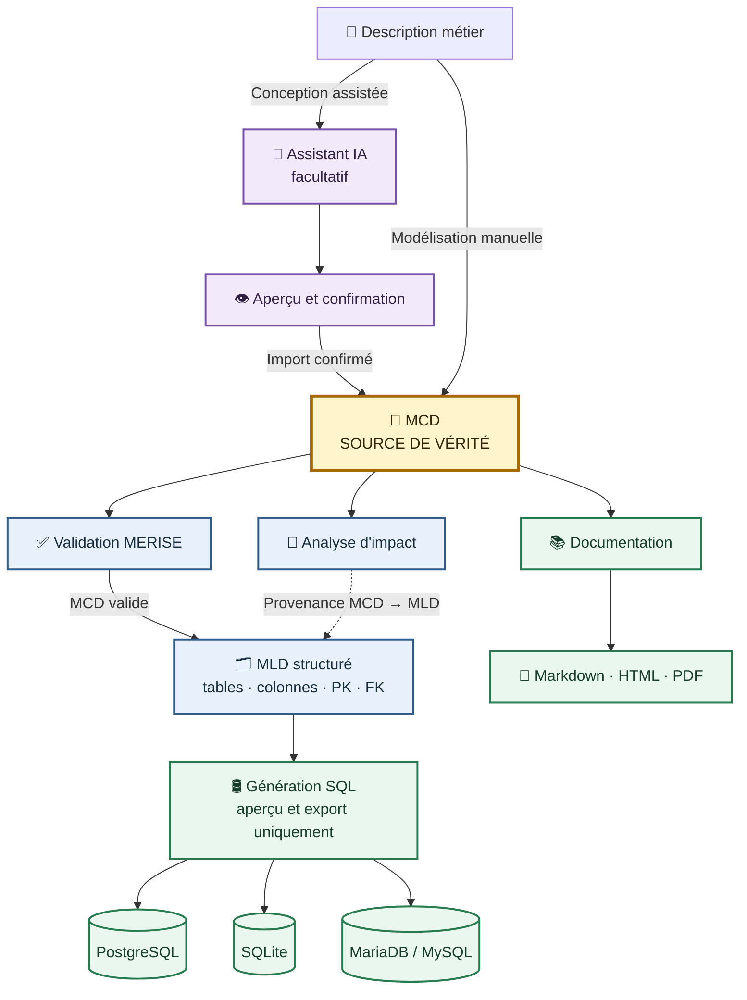

<p align="center">
  
</p>

<h1 align="center">MERISOR</h1>

<p align="center">
  <strong>Du modèle métier au script SQL, dans une application de bureau libre.</strong>
</p>

<p align="center">
  <a href="https://github.com/nouhailler/merisor/releases/latest"></a>
  
  
  <a href="https://github.com/nouhailler/merisor/actions/workflows/quality.yml"></a>
  <a href="https://pypi.org/project/merisor/"></a>
  <a href="https://github.com/nouhailler/merisor/blob/main/LICENSE"></a>
</p>

MERISOR est un éditeur graphique MERISE pour Linux, destiné aux étudiants,
enseignants, analystes, développeurs et architectes de données. Il permet de
concevoir un MCD, contrôler sa cohérence, produire un MLD structuré et générer
du SQL PostgreSQL, SQLite ou MariaDB/MySQL.

Le modèle peut aussi être proposé ou analysé avec OpenRouter, mais **aucune
réponse IA ne modifie le document sans validation, aperçu et confirmation**.

> [!IMPORTANT]
> Le MCD reste la source de vérité. MERISOR génère des scripts SQL mais ne se
> connecte à aucune base et n'exécute jamais le SQL.

## 🗺️ Du besoin métier aux livrables



## 📸 Aperçu

### Construire le MCD


### Décrire les attributs


<table>
  <tr>
    <td width="50%"><strong>Examiner le MLD</strong></td>
    <td width="50%"><strong>Vérifier le SQL</strong></td>
  </tr>
  <tr>
    <td></td>
    <td></td>
  </tr>
</table>

### Préparer un MCD avec l'IA


## ✨ Fonctionnalités principales

- **MCD graphique** : entités, associations, attributs complets, identifiants
  composés, cardinalités, réflexives, n-aires et héritages ISA ;
- **canvas productif** : grille, guides, alignement, sélection multiple,
  copier/coller, domaines, minimap, recherche et disposition automatique ;
- **contrôles** : validation MERISE, qualité, normalisation 1NF/2NF/3NF,
  comparaison de versions et analyse d'impact ;
- **MLD explicable** : PK/FK composées, provenance, associations historisées et
  bouton **ⓘ Pourquoi ?** ;
- **SQL multi-dialecte** : PostgreSQL, SQLite, MariaDB/MySQL, aperçu et export ;
- **imports** : JSON V1/V2, DDL et schémas statiques PWA/IndexedDB, avec une
  [archive de démonstration prête à tester](examples/indexeddb-demo-pwa.zip) ;
- **exports** : PNG, SVG, PDF, Mermaid, Graphviz, documentation Markdown/HTML/PDF,
  données de test et requêtes SQL simples ;
- **IA facultative** : génération, conversation et réparation avec validation
  locale, normalisation prudente des réponses et confirmation humaine ;
- **historique** : opérations importantes annulables avec Annuler/Rétablir.

Le logo MERISOR est utilisé de manière cohérente dans la fenêtre principale,
le lanceur desktop, les paquets et cette page.

Le détail se trouve dans le [guide utilisateur](docs/user/GUIDE_UTILISATEUR.md).

## 🚀 Installation rapide

### AppImage

Téléchargez l'AppImage depuis la
[dernière release](https://github.com/nouhailler/merisor/releases/latest) :

```bash
chmod +x MERISOR-*.AppImage
./MERISOR-*.AppImage
```

### Debian / Ubuntu

```bash
sudo apt install ./merisor_*_amd64.deb
```

### PyPI avec pipx

```bash
pipx install merisor
merisor
```

Avec le trousseau sécurisé OpenRouter :

```bash
pipx install "merisor[ai]"
```

### Depuis les sources

```bash
git clone https://github.com/nouhailler/merisor.git
cd merisor
python3 -m venv .venv
source .venv/bin/activate
python -m pip install -e ".[test,ai]"
python -m merisor
```

Voir la [documentation d'installation développeur](docs/development/DEVELOPMENT.md).

## 🖱️ Premier modèle

1. Créez une entité et ses attributs.
2. Marquez au moins un attribut comme identifiant.
3. Créez une association et reliez-la aux entités.
4. Définissez `(0,1)`, `(0,N)`, `(1,1)` ou `(1,N)`.
5. Validez le MCD.
6. Générez le MLD et utilisez **ⓘ Pourquoi ?**.
7. Générez puis exportez le SQL du dialecte choisi.

Le tutoriel détaillé est disponible dans
[Prise en main](docs/user/PRISE_EN_MAIN.md). Vous pouvez également ouvrir
[l'exemple MotoGP](examples/motogp.json) ou tester le reverse-engineering avec
[la PWA IndexedDB de démonstration](examples/indexeddb-demo-pwa/README.md).

## 🧱 Architecture simplifiée

```text
MCDModel ──> McdToMldTransformer ──> MLDModel ──> SQLGenerator
   │                                      │             │
   └── JSON + validation                  └── vues       └── dialectes
```

Le domaine métier ne dépend pas de Qt. Les mutations passent par le contrôleur
et les commandes annulables. Consultez
[Architecture](docs/technical/ARCHITECTURE.md) et les
[ADR](docs/decisions/CONTEXT.md).

## 📚 Documentation

Dans l'application, ouvrez **Documentation → Centre de documentation…** ou
appuyez sur `F1`. Le manuel Markdown est inclus dans les paquets et reste
également consultable sur GitHub.

- [Portail documentaire](docs/INDEX.md)
- [Guide utilisateur](docs/user/GUIDE_UTILISATEUR.md)
- [Concepts MERISE](docs/concepts/MERISE.md)
- [Règles MCD → MLD](docs/concepts/REGLES_MCD_MLD.md)
- [Format JSON V2](docs/technical/JSON_FORMAT.md)
- [Architecture](docs/technical/ARCHITECTURE.md)
- [Sécurité](docs/technical/SECURITY.md)
- [Contribuer](docs/development/CONTRIBUTING.md)
- [Journal des changements](CHANGELOG.md)

## ⚠️ Limites principales

- pas de connexion, migration ou exécution automatique sur une base active ;
- le reverse engineering DDL ne retrouve pas toutes les intentions MERISE ;
- héritage multiple et cycles ISA refusés ;
- les stratégies ISA aplaties refusent une association portée par une table
  supprimée ; utilisez `JOINED` ;
- une association 1:1 porteuse d'attributs doit être matérialisée ;
- les contrôles de normalisation dépendent des règles métier déclarées ;
- les fonctions IA dépendent des quotas OpenRouter et peuvent se tromper.

La liste expliquée est maintenue dans la [FAQ](docs/user/FAQ.md) et les guides
conceptuels.

## 🤝 Contribuer

Les contributions sont bienvenues. Avant une pull request :

```bash
ruff format --check .
ruff check .
mypy
QT_QPA_PLATFORM=offscreen pytest
```

Lisez [CONTRIBUTING.md](docs/development/CONTRIBUTING.md) et ouvrez une
[issue](https://github.com/nouhailler/merisor/issues) pour discuter d'une
évolution importante.

## 📄 Licence

MERISOR est distribué sous [licence MIT](LICENSE).

---

<p align="center">
  Conçu pour rendre MERISE accessible sans sacrifier la structure du modèle.
</p>
