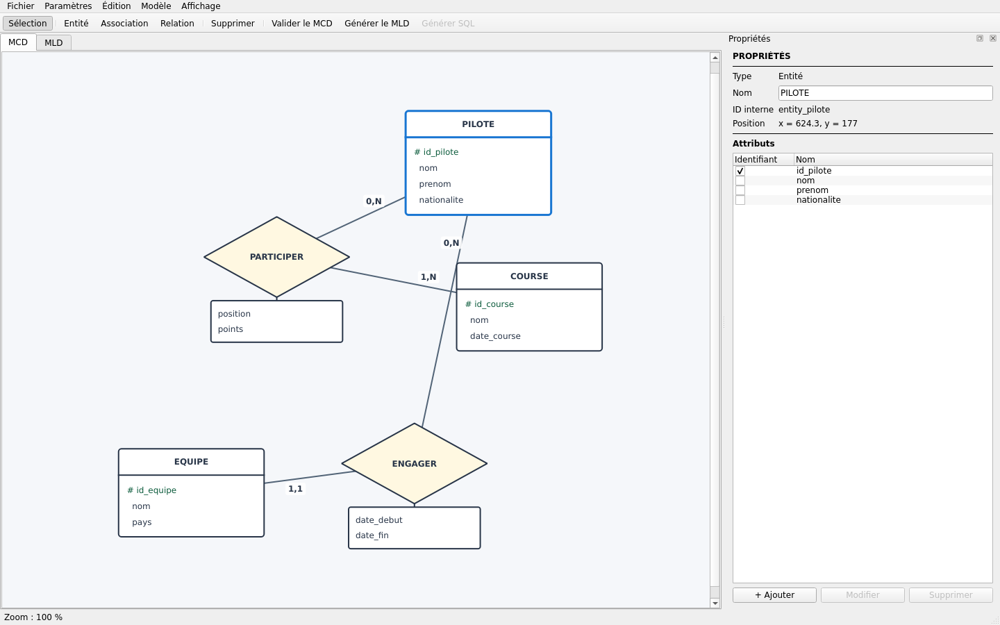

# Guide utilisateur

[← Portail](../INDEX.md) · [Prise en main](PRISE_EN_MAIN.md) · [FAQ](FAQ.md)

## L'espace de travail

MERISOR réunit :

- les onglets **MCD** et **MLD** ;
- une barre d'outils de création et de génération ;
- le panneau contextuel **Propriétés** ;
- une barre d'état ;
- une minimap optionnelle pour les grands modèles.

## Fichiers et historique

- **Nouveau**, **Ouvrir**, **Ouvrir récent**, **Enregistrer** et
  **Enregistrer sous** manipulent le JSON du projet.
- `Ctrl+Z` et `Ctrl+Shift+Z` annulent ou rétablissent les commandes.
- Un modèle invalide peut être sauvegardé ; MERISOR ne détruit jamais un
  travail incomplet.
- Les importations confirmées et les réparations IA sont appliquées comme une
  seule commande annulable.

## Construire un MCD

Utilisez **Entité**, **Association** et **Relation**. Les liens restent attachés
aux objets pendant les déplacements. La sélection d'un objet affiche ses
propriétés et permet de modifier son nom, ses attributs ou sa cardinalité.

Un attribut gère : nom, type logique, longueur, précision/échelle, nullabilité,
valeur par défaut, unicité, commentaire, identifiant, auto-incrémentation et
expressions `CHECK`.

Voir [Créer et éditer un MCD](MCD.md).

## Organiser un grand diagramme

- disposition automatique ;
- alignement et distribution d'une sélection multiple ;
- grille, aimantation et guides ;
- copier, coller et dupliquer ;
- couleurs par domaine et vues métier/technique ;
- recherche visuelle, pliage des attributs, minimap et plein écran ;
- **Affichage → Explorer le modèle…** pour isoler un voisinage sans modifier le
  document.

## Contrôler la qualité

Le menu **Modèle** propose :

- validation structurelle MERISE ;
- score de qualité explicable ;
- analyse d'impact ;
- comparaison avec une autre version JSON ;
- assistant de normalisation 1NF/2NF/3NF ;
- analyse et réparation facultative avec l'IA.

Les analyses ne changent pas le modèle. Une correction ne s'applique qu'après
une action et, lorsqu'elle est proposée par l'IA, après un aperçu explicite.

## Produire le MLD et le SQL

Le MCD validé produit un `MLDModel` indépendant du SGBD. L'onglet MLD présente
les tables, colonnes, PK, FK, UNIQUE et nullabilité. **ⓘ Pourquoi ?** explique
chaque décision. Le générateur SQL traduit ensuite le MLD vers le dialecte
choisi.

Voir [Générer le MLD](MLD.md) et [Générer du SQL](SQL.md).

## Importer

- un fichier JSON MERISOR V1 ou V2 ;
- un DDL PostgreSQL, SQLite ou MySQL/MariaDB pris en charge ;
- les schémas statiques Dexie/IndexedDB d'un projet PWA local ou ZIP ;
- un MCD proposé par OpenRouter après validation et confirmation.

Le reverse engineering ne peut pas retrouver toutes les intentions métier :
vérifiez les cardinalités minimales, l'historisation et les concepts reconstruits.

Pour essayer cette fonction sans chercher un projet externe, téléchargez
[l'archive IndexedDB de démonstration](https://github.com/nouhailler/merisor/raw/main/examples/indexeddb-demo-pwa.zip),
puis choisissez **Archive ZIP** dans la commande d'import PWA.

## Exporter

- MCD ou MLD : PNG, SVG, PDF, Mermaid ou Graphviz/DOT ;
- SQL : fichier `.sql` ;
- documentation du modèle : Markdown, HTML ou PDF ;
- données de test : script `INSERT` sans exécution ;
- requête `SELECT` simple construite depuis les FK du MLD.

## IA

La clé OpenRouter n'est jamais stockée dans le projet. Les appels sont
asynchrones et le document courant reste inchangé tant qu'un aperçu n'est pas
confirmé. Voir [Utiliser les fonctions IA](IA.md).

## Documentation intégrée

`F1` ouvre ce manuel. La recherche filtre les rubriques ; les liens internes
restent dans le lecteur et les liens Web s'ouvrent dans le navigateur système.
