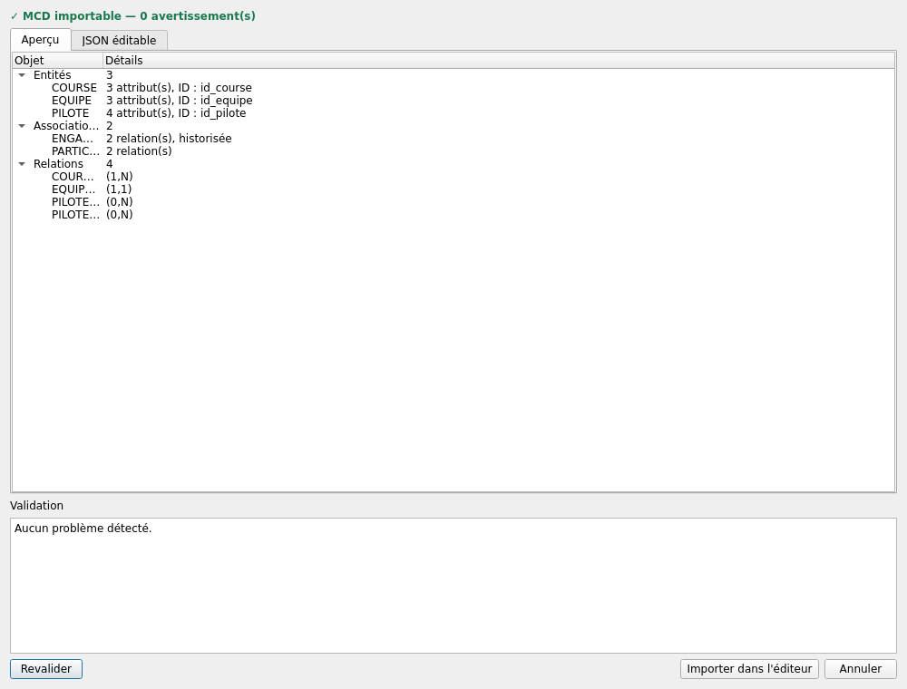

# Utiliser les fonctions IA

[← Portail](../INDEX.md) · [Sécurité](../technical/SECURITY.md)

Les fonctions IA utilisent OpenRouter de manière facultative. Elles ne sont
jamais nécessaires pour valider, transformer ou documenter un MCD.

## Configuration

1. Ouvrez **Paramètres → Paramètres OpenRouter…**.
2. Activez l'IA.
3. Saisissez la clé et utilisez **Tester la clé**.
4. Actualisez les modèles gratuits compatibles texte.
5. Choisissez un modèle.

Avec `keyring`, la clé est placée dans le trousseau système. Le repli QSettings
n'est pas chiffré et affiche un avertissement. La clé ne rejoint jamais un JSON
MERISOR, un SQL, un log ou Git.

## Génération ponctuelle

**Modèle → Générer un MCD avec l'IA…** transforme une description métier en
JSON V2 imposé. Le candidat est rechargé, validé et affiché. Seul **Confirmer
l'import** remplace le document, en une commande annulable.

## Assistant de modélisation

**Modèle → Assistant de modélisation conversationnel…** propose un parcours en
six étapes clairement affichées :

1. **Décrire** le besoin métier en langage courant ;
2. **Comprendre** les concepts candidats détectés ;
3. répondre aux **questions métier** qui influencent réellement la structure ;
4. examiner la **proposition** MCD dans un brouillon isolé ;
5. consulter **Pourquoi ?** pour chaque entité, association ou cardinalité
   proposée ;
6. effectuer la **validation humaine**, puis confirmer éventuellement l'import.

Les hypothèses et niveaux de confiance restent visibles. Les justifications
indiquent l'élément concerné, la décision prise et la raison métier utilisée.
L'assistant ne modifie que son brouillon via des patchs structurés et chaque
révision est validée avant l'aperçu. Fermer la fenêtre abandonne le brouillon.

## Analyse et réparation

**✨ Analyser avec l'IA…** transmet une copie du MCD et ses signaux locaux de
qualité. Les propositions disposent de **Voir**, **Ignorer** et **Appliquer**.
Deux patchs concurrents sont refusés ; une confirmation finale reste obligatoire.

## Suggestions de normalisation

OpenRouter peut suggérer des dépendances fonctionnelles. Elles restent des
hypothèses jusqu'à confirmation et n'annulent pas le besoin de connaître les
règles métier.

## Données envoyées

Selon l'action : description, brouillon, MCD courant, validation, signaux de
qualité et derniers tours nécessaires. Ces données vont à OpenRouter puis au
fournisseur du modèle sélectionné. N'envoyez pas de données personnelles ou
secrètes sans autorisation.

## Erreurs et quotas

Les appels tournent dans un thread Qt. Une erreur réseau, un quota ou un JSON
invalide affiche un message et ne modifie pas le document.
