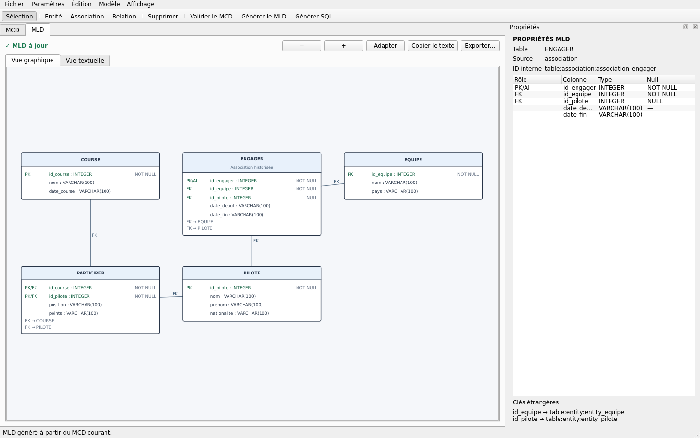

# Générer et lire le MLD

[← Portail](../INDEX.md) · [Règles MCD → MLD](../concepts/REGLES_MCD_MLD.md)

## Génération

Utilisez **Générer le MLD** après validation. Les erreurs du MCD bloquent la
transformation ; les avertissements restent visibles. Le MLD est recalculable
et n'est pas la source de vérité.

## Contenu

Le modèle logique contient :

- tables et colonnes typées ;
- clé primaire simple ou composée ;
- clés étrangères simples ou composées ;
- contraintes UNIQUE et CHECK ;
- nullabilité, valeur par défaut et auto-incrémentation logique ;
- provenance vers les entités, associations, attributs, relations et ISA.

## Vue graphique et textuelle

La vue graphique permet sélection, zoom et recentrage. Le panneau de propriétés
détaille la table sélectionnée. La vue textuelle peut être copiée ou exportée.

## « ⓘ Pourquoi ? »

Le bouton explique sans IA :

- pourquoi une table existe ;
- comment sa PK a été déterminée ;
- la migration de chaque identifiant ;
- la FK et la cardinalité source ;
- `NULL`, `NOT NULL`, UNIQUE et CHECK ;
- les règles d'historisation, de n-aire ou d'ISA.

L'explication est fondée sur les identifiants de provenance réellement produits
par le transformateur.

## État obsolète

Une modification logique du MCD rend le MLD obsolète. La génération SQL et
**ⓘ Pourquoi ?** sont alors désactivés jusqu'à régénération. Un déplacement
graphique seul ne change pas l'empreinte logique.

## Étape suivante

Consultez [Générer du SQL](SQL.md) et les
[règles détaillées](../concepts/REGLES_MCD_MLD.md).
