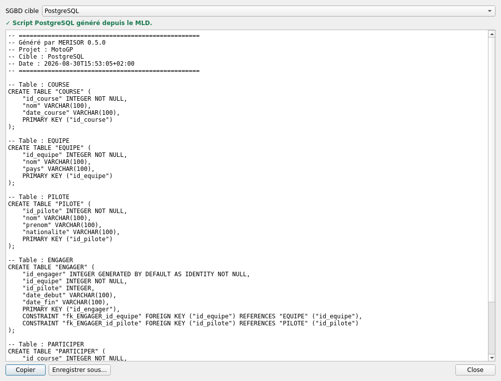

# Générer et exporter du SQL

[← Portail](../INDEX.md) · [Dialectes](../technical/SQL_DIALECTS.md)

## Prérequis

Le bouton **Générer SQL** exige un MLD présent, valide et à jour. Le générateur
ne consulte jamais directement le MCD.

## Cibles

- PostgreSQL ;
- SQLite ;
- MariaDB/MySQL.

Le dialecte traduit les types, l'auto-incrémentation et l'échappement des noms.
PK, FK, UNIQUE, CHECK et index proviennent exclusivement du MLD.

## Aperçu et export

1. Choisissez la cible.
2. Lisez les erreurs et avertissements de validation.
3. Examinez le script.
4. Copiez-le ou enregistrez-le avec l'extension `.sql`.

MERISOR n'ouvre aucune connexion et n'exécute aucune instruction. Testez le
script dans un environnement contrôlé avant production.

## Ordre et cycles

Les tables sont ordonnées selon les FK. Lorsqu'un cycle empêche de déclarer
toutes les contraintes directement, les dialectes compatibles utilisent une
seconde phase `ALTER TABLE`. SQLite reçoit une stratégie adaptée à ses limites.

## Autres générateurs

**Outils** permet aussi de produire :

- des `INSERT` synthétiques respectant les FK ;
- une requête `SELECT` simple à partir d'une intention métier.

Ces scripts sont seulement générés et ne sont jamais exécutés.
